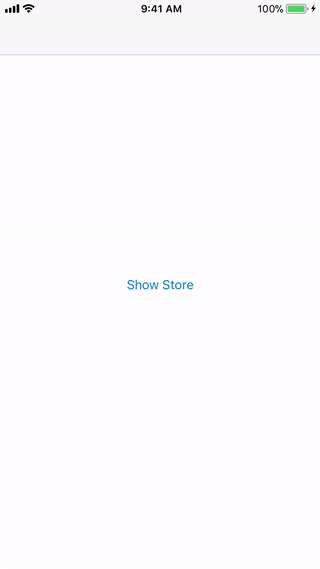

# SimpleStoreUI
<p align="center">
    <a href="https://cocoapods.org/pods/SimpleStoreUI">
        
    </a>
    
    <a href="https://cocoapods.org/pods/SimpleStoreUI">
        
    </a>
    <a href="https://swift.org/package-manager">
        
    </a>
    <a href="https://twitter.com/mahmudahsan">
        
    </a>
</p>
<p>
A table view based view controller to show in app purchase items and functionality quickly within app based on <a href="https://github.com/bizz84/SwiftyStoreKit">SwiftStoreKit</a> library. I created this UI based library so that in all my apps I can quickly integrate in app purchase store. 
</p>
<p>
<a href="https://github.com/bizz84/SwiftyStoreKit">SwiftStoreKit</a> did the heavy tasks based on StoreKit APIs. My UI based library just use some of those functions and a quick and simple UI to integrate faster.

</p>
<p align="center">
    
</p>	

## Features

- [X] List in app purchase items within app in table style
- [X] Each item has image, title and price 
- [X] Currently the UI only supports non-consumable item.
- [X] Based on <a href="https://github.com/bizz84/SwiftyStoreKit">SwiftStoreKit</a> library

 
## Example How to implement

### Step 1: Add the following code in AppDelegate.swift

```swift
let iAP_RemoveAd = "net.yourcompany.product"

func application(_ application: UIApplication, didFinishLaunchingWithOptions launchOptions: [UIApplicationLaunchOptionsKey: Any]?) -> Bool {
        loadStore()
        return true
  }
  
  func loadStore(){
    StoreManager.shared.completeTransactionAtAppLaunch()
    StoreManager.shared.shouldAddStorePaymentHandling(true)
    StoreManager.shared.storeItems = [
        Product(name: "Restore", productId: StoreManager.RestoreAll, price: "", purchased: false, image: "iap_restore"),
        Product(name: "Remove Ads", productId: iAP_RemoveAd, price: "", purchased: false, image: "iap_remove_ads"),
    ]
    StoreManager.shared.loadStoreProducts()
  }
```

* In this example we define only one in app purchase item named iAP_RemoveAd. If you have many in app purchase items, you can define all here or some where else.
* Fill StoreManager.shared.storeItems with your in app purchase items. If you don't want to show Restore feature, you can remove the first line. Also you may or may not fill the price argument as it will auto fill later by the Store Manager.
* purchased: false is the default value. When the store load, StoreManager will check and updated price and purchased fields.

### Step 2: In your main view controller write the following codes

```swift
import UIKit
import MBProgressHUD
import SimpleStoreUI

extension UIViewController {
    //MARK: - Top View Controller
    static func topViewController()-> UIViewController{
        var topViewController:UIViewController = UIApplication.shared.keyWindow!.rootViewController!
        
        while ((topViewController.presentedViewController) != nil) {
            topViewController = topViewController.presentedViewController!;
        }
        
        return topViewController
    }
}

class ViewController: UIViewController {
    @IBAction func showStore(_ sender: Any) {
    //Main code to add the Store UI within app
        let bundle  = Bundle(for: StoreViewController.self)
        let storeVC = StoreViewController(nibName: "StoreViewController", bundle: bundle)
        StoreManager.shared.storeManagerDelegate = self
        
        storeVC.title     = "Store"
        self.navigationController?.pushViewController(storeVC, animated: true)
    }
}

extension ViewController : StoreManagerDelegate {
    //MARK:- HudDelegate
    public func showHud() {
        print("Show HUD")
        MBProgressHUD.showAdded(to: UIViewController.topViewController().view, animated: true)
    }
    
    public func hideHud() {
        MBProgressHUD.hide(for: UIViewController.topViewController().view, animated: true)
    }
    
    public func purchaseSuccess(productId: String) {
        if productId == iAP_RemoveAd {
            // TODO: DO SOMETHING
            print("Remove Ads Purchase Success. Do Something!")
            
        }
    }
}
```

* showStore() function demonstrate how to show the UI.
* StoreManagerDelegate has 3 functions. You can modify all of this
* purchaseSuccess() with productId will be called every time user purchase any non-consumable item or restore any of them. It's your job to define how to give the feature to your user based on productId.


### Step 3: To know whether user purchase any item or not use the following function

```swift
StoreManager.shared.isProductPurchased(Constants.kIAPRemoveAds)
```

## Usage in an iOS application

Either

- Drag the folders SimpleStore/Sources folder into your application's Xcode project. 

or

- Use CocoaPods or the Swift Package manager to include SimpleStore as a dependency in your project.

```Ruby
pod 'SimpleStoreUI'
```
or
```Ruby
pod 'SimpleStoreUI', :git => 'https://github.com/mahmudahsan/SimpleStoreUI'
```

* In your project add the icons of your in app purchase items. Better use StoreIcons.assets to add icons. You will find this StoreIcons.assets in the demo folder


## Questions or feedback?

Feel free to [open an issue](https://github.com/mahmudahsan/SimpleStoreUI/issues/new), or find me [@mahmudahsan on Twitter](https://twitter.com/mahmudahsan).
